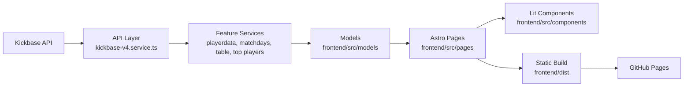

**For educational and non-profit uses only. All trademarks, logos and brand names are the property of their respective owners.**

  
   
  <h1>Kickbase Bundesliga</h1>
  This project is a used to gather data from <a href="https://www.kickbase.com/">Kickbase</a> API endpoint and visualize it in a web interface, acting as alternative for the pro membership.

  ---

  <!-- Placeholder for badges -->
 

# Architecture

Kurz erklärt:
- `kickbase-v4.service.ts` ist der zentrale Zugriff auf die Kickbase-API.
- Die Feature-Services bereiten daraus Daten für Spieler, Teams, Tabelle und Spieltage auf.
- `models` mappen rohe API-Daten in Frontend-Objekte.
- `pages` bauen die Routen und übergeben Daten an die Lit-Komponenten.
- GitHub Actions erzeugt daraus statische Dateien für GitHub Pages.

# How to setup

### Frontend
- **Install dependencies:**
    - `npm install` Install the dependencies
- **Run frontend:**
    - `npm start` or `npm run dev` Start the development server
    - Frontend will be reachable under http://localhost:3000/
- **Kickbase v4 access:**
    - create `/Users/andy/WebstormProjects/kickbase-bundesliga/frontend/.env`
    - you can copy the template from `/Users/{username}/WebstormProjects/kickbase-bundesliga/frontend/.env.example`
    - simplest setup inside `.env`:
      `KICKBASE_EMAIL=your-email`
      `KICKBASE_PASSWORD=your-password`
    - optional overrides:
      `KICKBASE_COMPETITION_ID=1`
      `KICKBASE_LEAGUE_ID=deine-league-id`
      `KICKBASE_TOKEN=your-bearer-token`
    - if only email/password are set, the app logs in automatically during build/server rendering and picks the first league matching the requested competition.

### Thanks to
- [@FelixSchuSi](https://github.com/FelixSchuSi) for the base of the frontend
- [@kevinskyba](https://github.com/kevinskyba) for the [Kickbase API documentation](https://github.com/kevinskyba/kickbase-api-doc)

---
