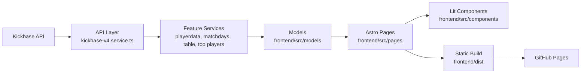

**Unofficial fan-made project for educational and non-commercial purposes only. Kickbase and all related trademarks, logos, and brand names are the property of their respective owners.**

<div align="center">
  <br />
  <a href="https://senoramarillo.github.io/kickbase-bundesliga/" target="_blank">
    
  </a>
  <br />

  <div>
    
    
    
    <br />
    
    
    
  </div>

  <h3 align="center">Kickbase Bundesliga | Unofficial Bundesliga Stats Frontend</h3>

  <div align="center">
    A static Astro + Lit web app that fetches Kickbase data and turns it into a fast, browsable Bundesliga companion with tables, matchdays, squads, and top-player views.
  </div>
</div>

## Table of Contents

1. [Introduction](#introduction)
2. [Preview](#preview)
3. [Tech Stack](#tech-stack)
4. [Features](#features)
5. [Architecture](#architecture)
6. [Getting Started](#getting-started)
7. [Environment Variables](#environment-variables)
8. [Deployment](#deployment)
9. [Credits](#credits)
10. [Disclaimer](#disclaimer)

## Introduction

Kickbase Bundesliga is an unofficial football data frontend focused on the German Bundesliga. The project pulls data from the Kickbase v4 API, maps the responses into frontend-friendly models, and renders the result as a statically built site that can be deployed to GitHub Pages.

The repository is organized around a simple separation of concerns:

- `frontend/src/services` handles API access and feature-specific data preparation.
- `frontend/src/models` converts raw API responses into application models.
- `frontend/src/pages` defines Astro routes and server-side page loading.
- `frontend/src/components` contains Lit-based UI components.

## Preview

- Live site: [senoramarillo.github.io/kickbase-bundesliga](https://senoramarillo.github.io/kickbase-bundesliga/)
- Main sections:
  - Bundesliga table
  - Matchday overview
  - Top players
  - Team and player detail views
  - 2. Bundesliga pages

## Tech Stack

### Frontend

- **[Astro](https://astro.build/)** for static site generation and server-side data loading.
- **[Lit](https://lit.dev/)** for interactive web components.
- **[TypeScript](https://www.typescriptlang.org/)** for typed services, models, and UI code.

### Data Layer

- **Kickbase v4 API** as the primary data source for competitions, players, teams, and matchdays.
- Lightweight in-memory request caching plus a temporary auth cache for repeated API access.

### Delivery

- **[GitHub Actions](https://github.com/features/actions)** to build the frontend.
- **[GitHub Pages](https://pages.github.com/)** to serve the generated static output.

## Features

- **League tables** with standings and team-level stats.
- **Matchday pages** with fixtures, results, and enriched match details.
- **Top player rankings** for current matchday and overall performance.
- **Squad and player views** with market value, points, and upcoming match information.
- **Bundesliga + 2. Bundesliga support** through competition-based routes.
- **Static deployment** for a lightweight hosting setup.

## Architecture



### High-Level Flow

1. The central API service manages authentication, retries, and cached requests.
2. Feature services combine raw responses into domain-specific frontend data.
3. Models normalize the data shape used by pages and components.
4. Astro pages fetch and prepare the data during server rendering or static build.
5. Lit components render the interactive parts of the interface.

## Getting Started

### Prerequisites

Make sure you have the following installed locally:

- [Node.js](https://nodejs.org/)
- [npm](https://www.npmjs.com/)
- [Git](https://git-scm.com/)

### Clone the Repository

```bash
git clone https://github.com/senoramarillo/kickbase-bundesliga.git
cd kickbase-bundesliga/frontend
```

### Install Dependencies

```bash
npm install
```

### Start the Development Server

```bash
npm run dev
```

The app will be available at `http://localhost:3000/`.

## Environment Variables

Create a `.env` file inside `frontend/` and use `frontend/.env.example` as a template:

```env
KICKBASE_EMAIL=your-email@example.com
KICKBASE_PASSWORD=your-password

# Optional
# KICKBASE_COMPETITION_ID=1
# KICKBASE_LEAGUE_ID=your-league-id
# KICKBASE_TOKEN=your-bearer-token
```

### Notes

- If `KICKBASE_EMAIL` and `KICKBASE_PASSWORD` are set, the app can log in automatically.
- `KICKBASE_TOKEN` can be used instead of credentials if you already have a valid bearer token.
- If no league is explicitly configured, the app selects the first league matching the requested competition.

## Deployment

The project is built and deployed through GitHub Actions.

### Current Workflow

- Build runs on pushes to `main`
- Manual execution is supported through `workflow_dispatch`
- A scheduled build also runs daily
- The generated `frontend/dist` output is pushed to the `gh-pages` branch

To adapt this setup for your own fork, update the GitHub Actions workflow and repository settings to match your target Pages repository and secrets.

## Credits

- [@kevinskyba](https://github.com/kevinskyba) for the [Kickbase API documentation](https://github.com/kevinskyba/kickbase-api-doc)
- [@FelixSchuSi](https://github.com/FelixSchuSi) for the original frontend foundation

## Disclaimer

This project is not affiliated with, endorsed by, or officially connected to Kickbase. It is a fan-made educational project intended for learning and experimentation only.
